# Charte graphique de "Le Village"

L'ensemble des sources graphiques sont dans le fichier [logo-levillage.afdesign](src/logo-levillage.afdesign). Fichier au format [Affinity Designer](https://affinity.serif.com/fr/designer/).

# Logo

## Logo Foncé

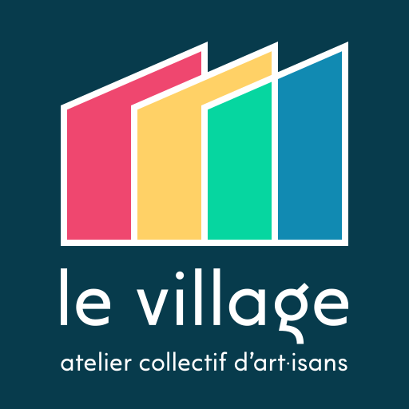

## Logo Clair

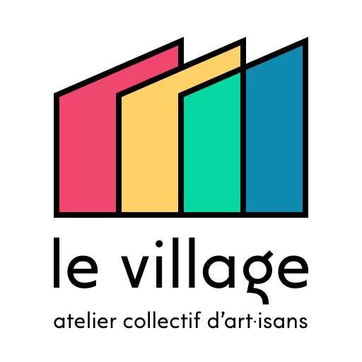

## Logo Noir&Blanc Foncé

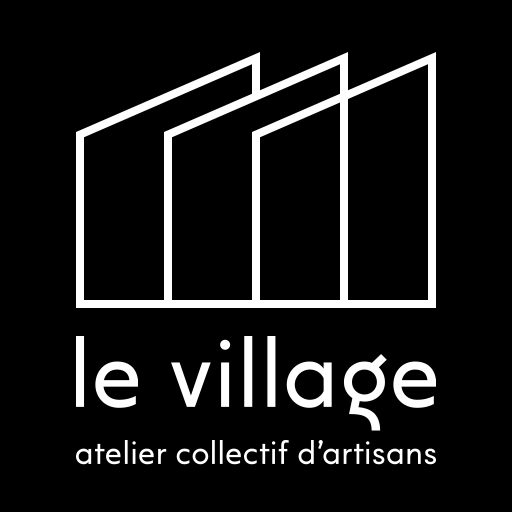

## Logo Noir&Blanc Clair

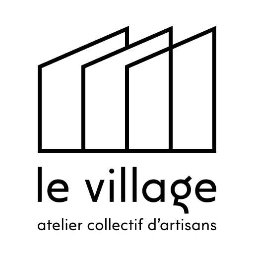

# Bannière

## Bannière Foncée

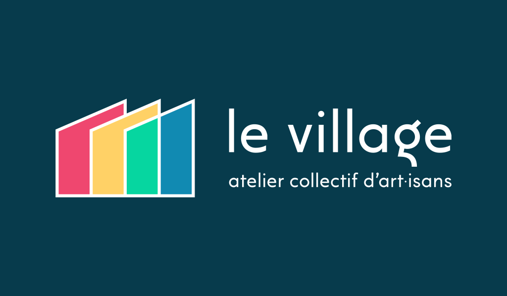

## Bannière Claire

## Bannière Noir&Blanc Foncée

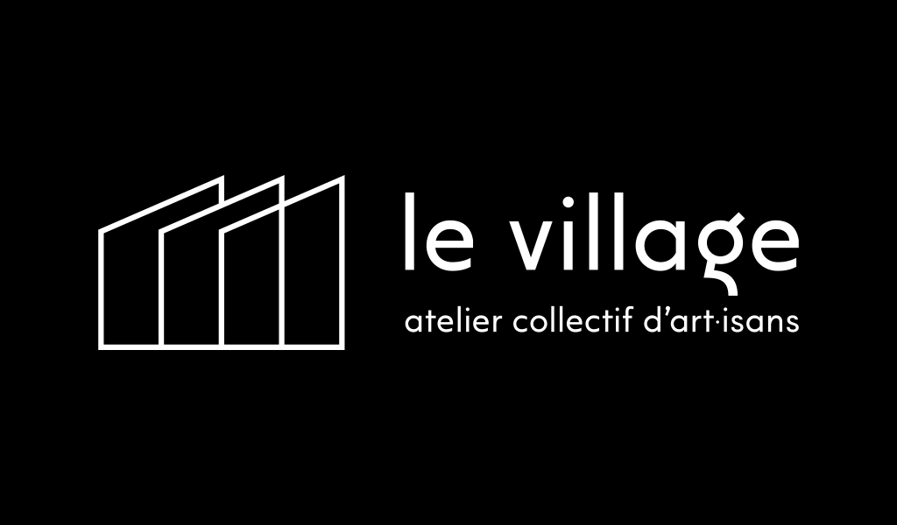

## Bannière Noir&Blanc Claire

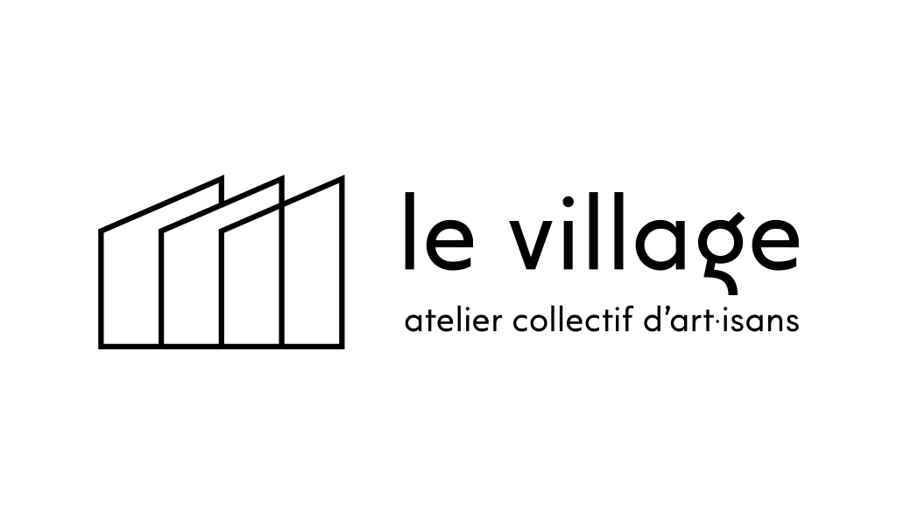

# Avatar

## Avatar Cercle

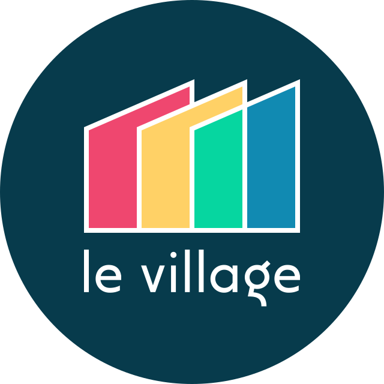

## Avatar Carré

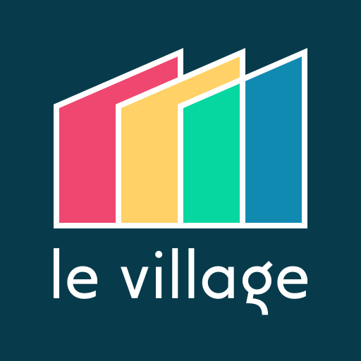

## Avatar Carré Arrondi

# Favicon

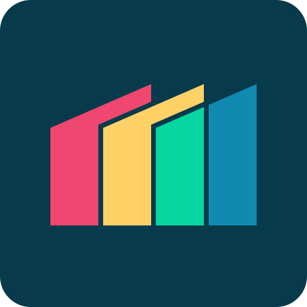

# Schémas

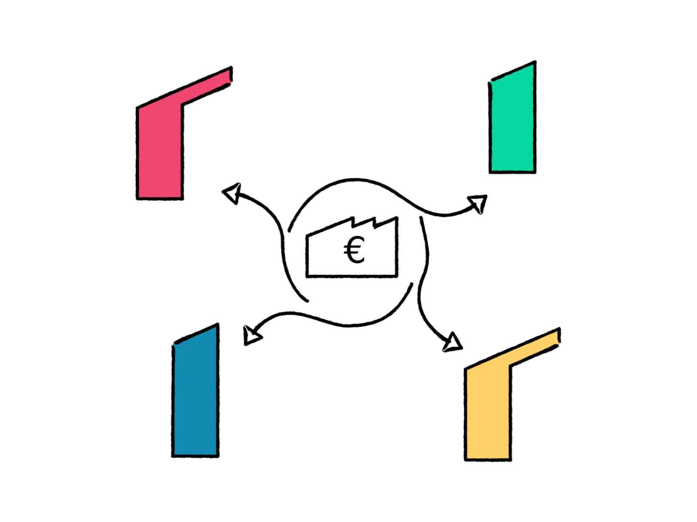
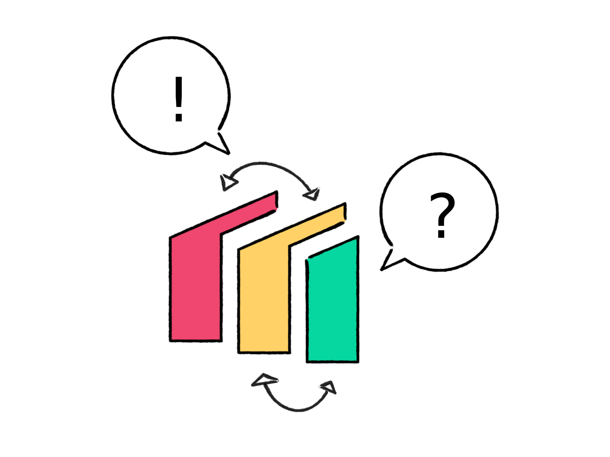

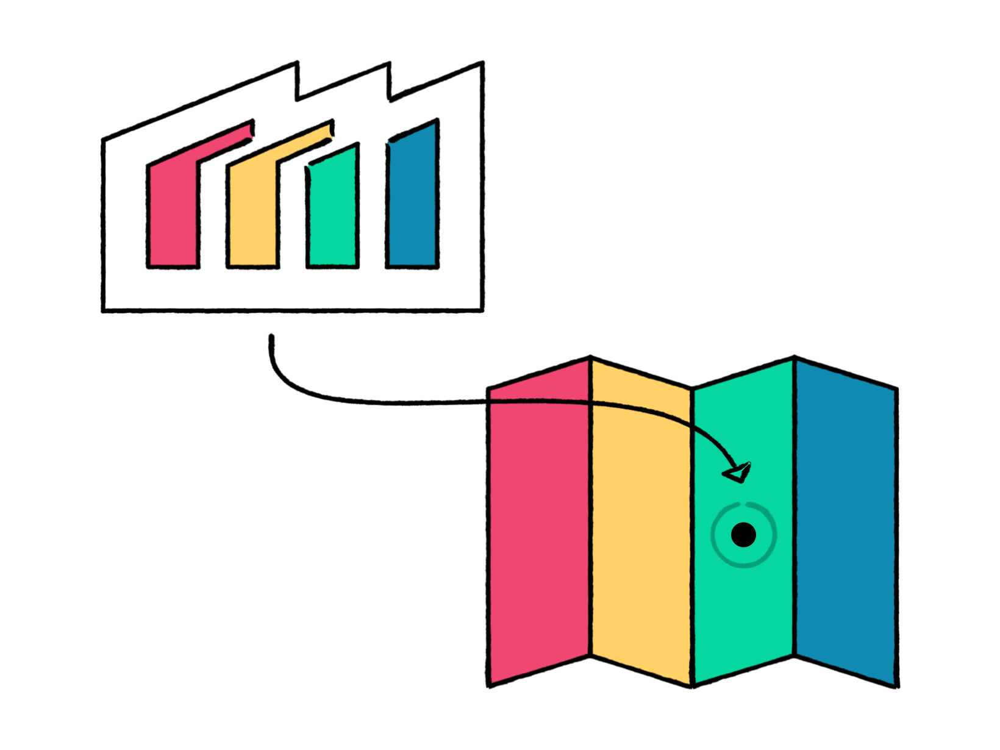

