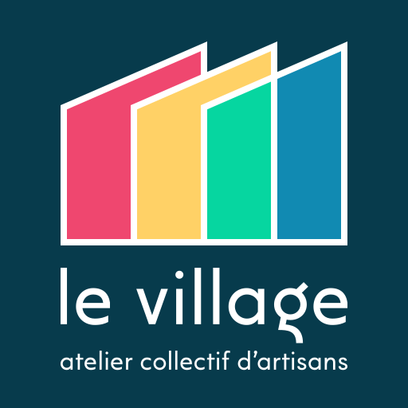
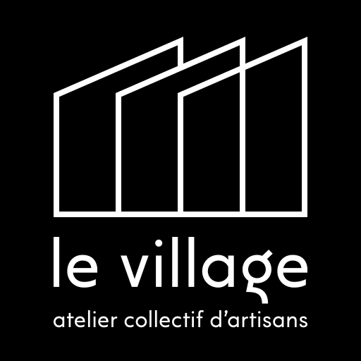
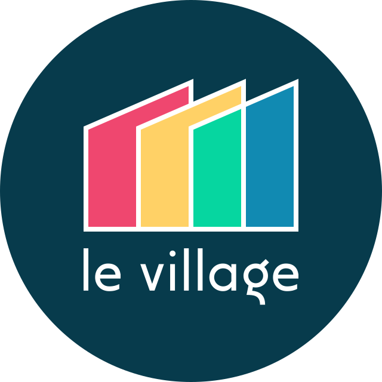
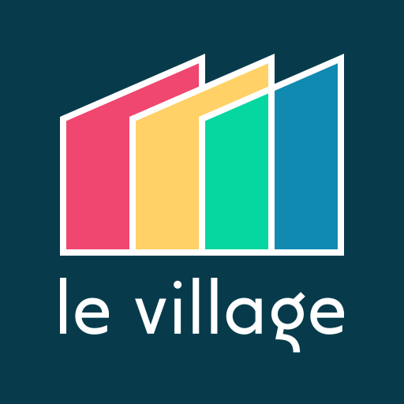
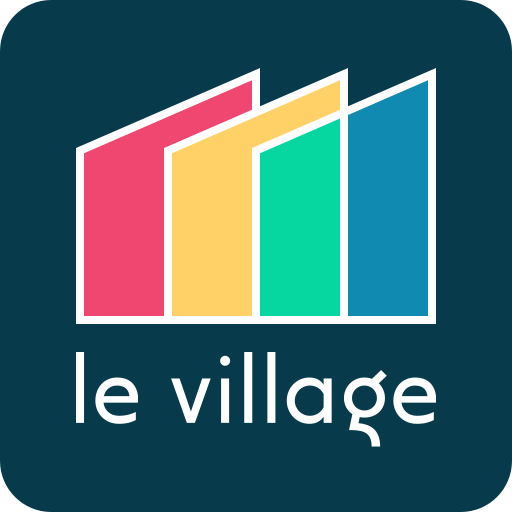

Charte graphique de "Le Village". L'ensemble des sources graphiques sont dans le fichier <logo-levillage.afdesign>. Fichier au format [Affinity Designer](https://affinity.serif.com/fr/designer/).

# Logo

## Logo Foncé

## Logo Clair

## Logo Noir&Blanc Foncé

## Logo Noir&Blanc Clair

# Bannière

# Avatar

## Avatar Cercle

## Avatar Carré

## Avatar Carré Arrondi

# Favicon

