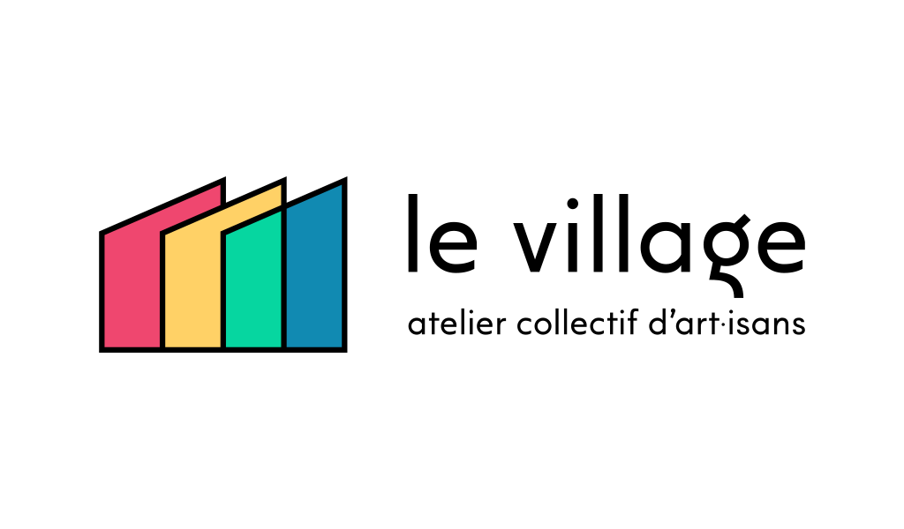

# Charte graphique de "Le Village"

L'ensemble des sources graphiques sont dans le fichier [logo-levillage.afdesign](src/logo-levillage.afdesign). Fichier au format [Affinity Designer](https://affinity.serif.com/fr/designer/).

# Logo

## Logo Foncé

## Logo Clair

## Logo Noir&Blanc Foncé

## Logo Noir&Blanc Clair

# Bannière

## Bannière Foncée

## Bannière Claire

## Bannière Noir&Blanc Foncée

## Bannière Noir&Blanc Claire

# Avatar

## Avatar Cercle

## Avatar Carré

## Avatar Carré Arrondi

# Favicon

# Schémas

